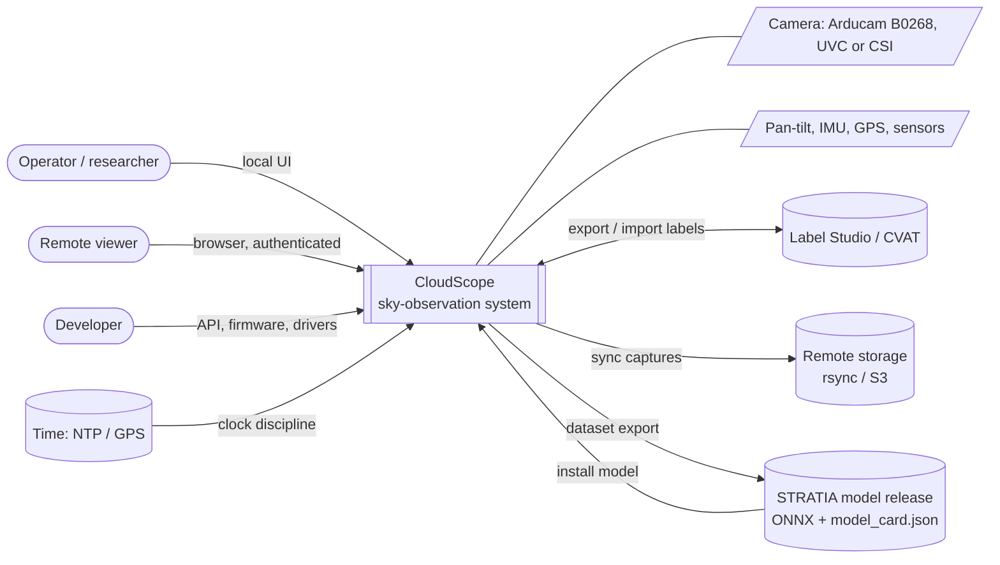
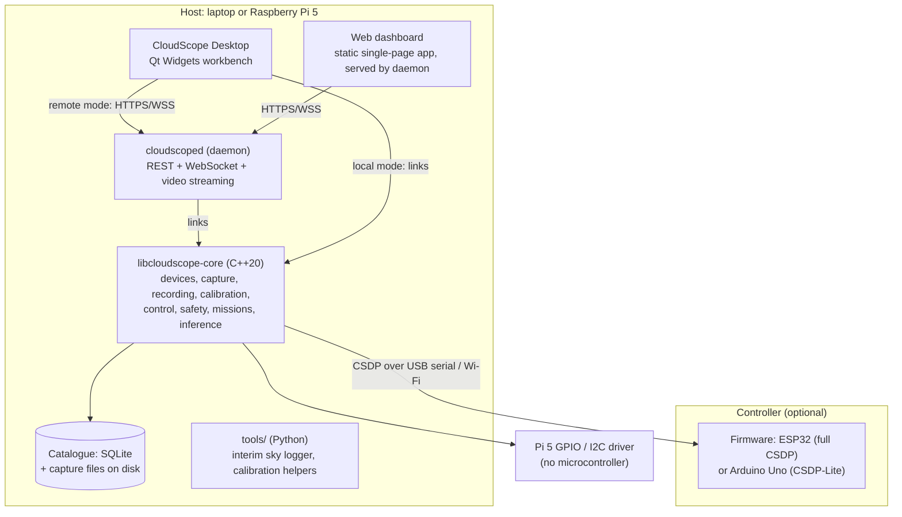
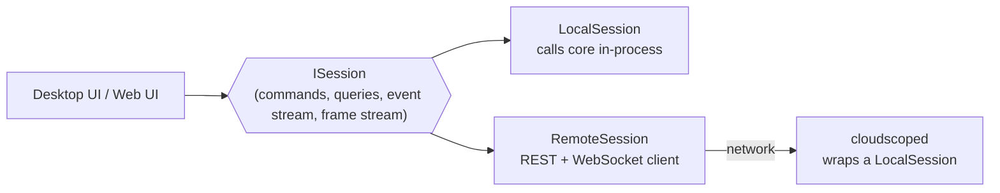
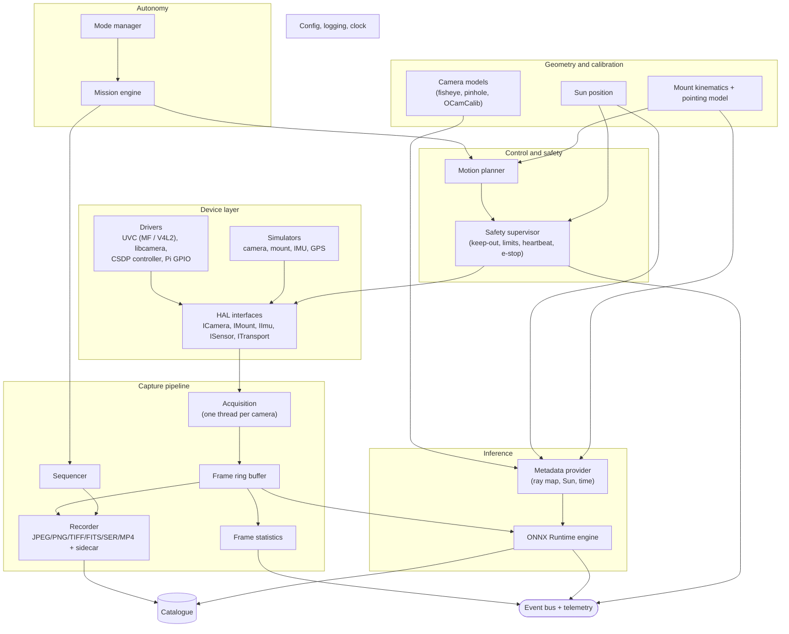
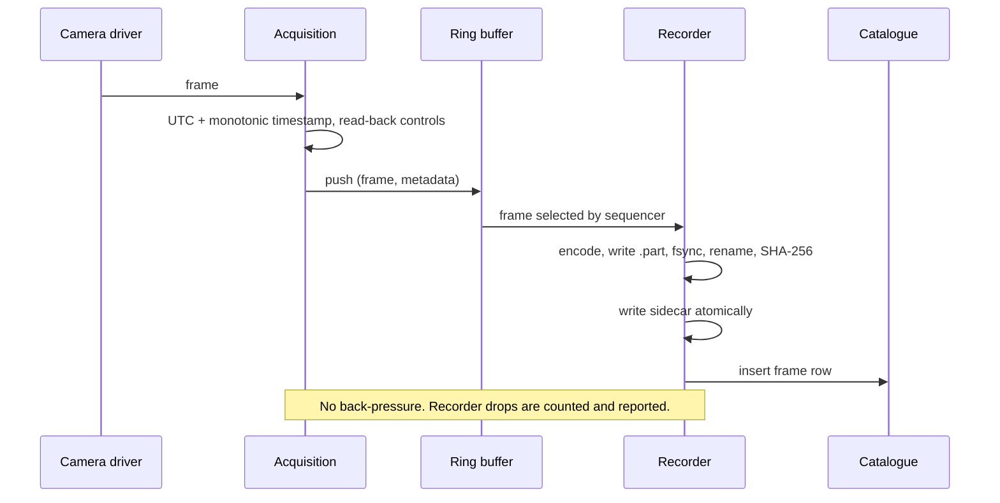
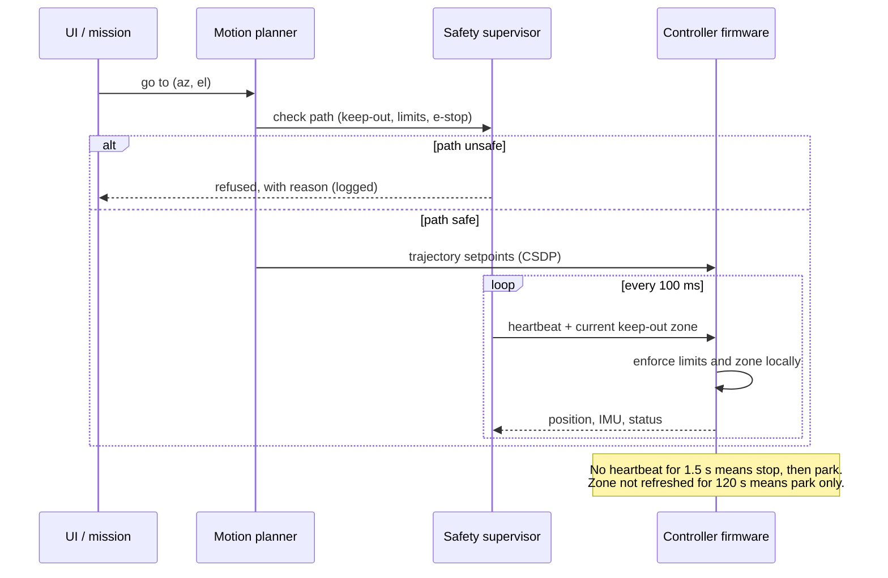

# CloudScope — System Architecture

Version 1.0 · Phase P007 · 2026-10-04 · Inputs: `docs/requirements/use_cases.md`, `docs/requirements/SRS.md`

This document describes CloudScope at three levels (C4 model: context, containers, components), then the runtime view (threads, data flow, failure handling) and the shared conventions (time, coordinates, configuration). Decisions with alternatives are recorded as ADRs in `docs/adr/` (P008).

---

## 1. Context (C4 level 1)

CloudScope consumes STRATIA models and produces data for STRATIA's training; it never trains models itself.

## 2. Containers (C4 level 2)

| Container | Technology | Responsibility | Runs on |
|---|---|---|---|
| `libcloudscope-core` | C++20, Qt 6 Core (no GUI), OpenCV, ONNX Runtime, SQLite | All domain logic. No UI code, no network server code. | Laptop, Pi 5 |
| `cloudscoped` | C++20, Drogon for HTTP/WebSocket (ADR-006) | Owns devices; exposes the Session API over the network; streams video; runs as a service | Laptop, Pi 5 |
| CloudScope Desktop | C++20, Qt Widgets, Qt Advanced Docking System | Workbench UI; works in-process (local mode) or as a client of a daemon (remote mode) | Laptop, Pi 5 with display |
| Web dashboard | Static HTML/JS bundle | Monitoring and control from any browser, phone included | Served by the daemon |
| Firmware | C/C++ (PlatformIO; Arduino-ESP32 + FreeRTOS; Arduino AVR) | Real-time actuation, sensor reading, local safety enforcement | ESP32, Arduino Uno |
| Catalogue and files | SQLite + filesystem | Frames, sidecars, sessions, telemetry, AI results | Host disk / external drive |
| `tools/` | Python 3 | Utilities that are not part of the runtime (sky logger, calibration scripts) | Laptop, Pi 5 |

Requirement groups by container: core library — FR-CAM, FR-REC, FR-SEQ, FR-CAL, FR-CTL, FR-SAF (host side), FR-MOD, FR-MIS, FR-AI, FR-DAT; daemon — FR-REM, FR-SEC; desktop application — FR-DSP; web dashboard — FR-REM-06; firmware — FR-FW, FR-SAF (controller side); packaging — FR-PLT.

### 2.1 One Session API, two transports

The UI must behave identically whether it runs next to the hardware or across the internet (FR-REM-07). Both clients therefore talk only to one interface:

- `ISession` is defined once (C++ interface + OpenAPI document generated from the same command list).
- The daemon is a thin adapter: it exposes a `LocalSession` over HTTP/WebSocket and adds authentication, roles and the control lock.
- Local mode avoids network and encoding cost for the live view (full-resolution frames stay in process memory).
- When a daemon is already running on the machine, the desktop app connects to it rather than opening devices itself, so two processes never fight over a camera.

## 3. Components of the core (C4 level 3)

| Component | Key responsibilities | SRS |
|---|---|---|
| HAL interfaces | Stable abstractions with capability descriptors; drivers register in a factory | FR-CTL-01 |
| Drivers | UVC via Media Foundation (Windows) and V4L2 (Linux); libcamera (Pi CSI); CSDP controller client; Pi 5 GPIO/I2C | FR-CAM-01…, FR-CTL-03…06 |
| Simulators | Same interfaces as drivers; outputs labelled simulated | FR-CTL-02, NFR-DATA-03 |
| Acquisition | Timestamps (UTC + monotonic), drop detection, read-back of controls | FR-CAM-04, FR-CAM-08 |
| Ring buffer | Lock-free, single producer; consumers choose *latest-only* or *lossless queue* semantics | NFR-PERF-01 |
| Recorder | Atomic writes, checksums, sidecars, FITS/SER writers | FR-REC-* |
| Sequencer | Fixed-rate schedules, stop/pause conditions, reconnect | FR-SEQ-* |
| Camera models / Sun / kinematics | Pixel ↔ ray ↔ az/el; Sun position; pan/tilt ↔ az/el | FR-CAL-06, FR-CTL-07 |
| Motion planner | Trajectories, soft limits, re-planning around the keep-out zone | FR-CTL-08, FR-SAF-01 |
| Safety supervisor | Fixed-rate loop independent of UI and missions; pushes keep-out zones and limits to firmware; owns e-stop state | FR-SAF-* |
| Mode manager / mission engine | Manual/Assisted/Autonomous; declarative missions; dry runs on simulators | FR-MOD-*, FR-MIS-* |
| Metadata provider / inference engine | Builds STRATIA inputs; latest-frame-only inference; contract checks; uncertainty gating | FR-AI-* |
| Catalogue | SQLite schema for sessions, frames, telemetry, AI results; retention | FR-DAT-01, FR-DAT-07 |
| Event bus | Typed events and telemetry samples to UI, logs and API | FR-REM-03 |

## 4. Runtime view

### 4.1 Threads

| Thread | Work | Never does |
|---|---|---|
| UI (desktop) | Rendering, input | Device I/O, file I/O, inference |
| Acquisition (per camera) | Read frames, timestamp, push to ring buffer | Encoding, disk writes |
| Recorder | Encode and write frames from its lossless queue | Block acquisition: if its queue fills, it records a drop and warns |
| Statistics | Histogram and frame statistics on the latest frame | — |
| Inference | Latest frame only; drops older frames | Queue frames |
| Controller I/O | CSDP framing, heartbeats, telemetry decode | Business logic |
| Safety supervisor | 10 Hz loop: keep-out zone, limits, heartbeat status, e-stop | Wait on any other thread |
| Mission engine | Step execution, condition evaluation | Direct hardware access (goes through planner and safety) |
| Network (daemon) | HTTP, WebSocket, video encoding | Device access other than through `LocalSession` |

### 4.2 Capture and save

### 4.3 Motion command with safety

### 4.4 Failure handling

| Failure | Detection | Response | SRS |
|---|---|---|---|
| Camera unplugged / driver hang | Grab failures, acquisition watchdog | Pause consumers, reopen with backoff, resume | FR-SEQ-05, NFR-REL-02 |
| Controller link lost | Missing telemetry / heartbeat | Firmware stops and parks; host marks mount unavailable; missions pause | FR-SAF-04 |
| Host crash | Firmware heartbeat timeout; service manager | Firmware parks; daemon restarts; missions resume per policy | NFR-REL-04 |
| Disk nearly full | Free-space check before each write | Stop recording, notify | FR-REC-07 |
| Power loss | — | Atomic writes guarantee no corrupt final files; resume on boot | NFR-REL-03 |
| Inference error / bad model | Exceptions, contract validation | Disable AI overlays, keep capturing, report | FR-AI-01, FR-AI-06 |
| Sun near optical axis | Safety supervisor | Refuse or re-plan motion; park if needed | FR-SAF-01 |

## 5. Conventions shared across CloudScope and STRATIA

### 5.1 Time
- All stored times are **UTC** with explicit offset (ISO 8601, millisecond resolution). Local time appears only in the UI, next to UTC.
- Scheduling uses the **monotonic** clock; wall-clock jumps never shift schedules.
- Each record states its **time source** (`host`, `ntp`, `gps-pps`).

### 5.2 Coordinate frames

| Frame | Definition |
|---|---|
| Image | Pixel (u, v), origin at the top-left pixel centre, u to the right, v down |
| Camera | Right-handed: +z along the optical axis, +x towards increasing u, +y towards increasing v |
| Mount | Pan angle about the vertical axis, tilt angle about the horizontal axis; zero positions defined by homing (P057) |
| Local horizontal | East-North-Up (ENU) at the site. **Azimuth** measured from geographic north, clockwise (east = 90°). **Elevation** from the horizon, up positive (zenith = 90°) |
| Sun | Azimuth/elevation in the local horizontal frame; true (geometric) and apparent (refracted) elevation are stored separately |

These conventions match the interim logger (P003) and STRATIA's ray-map definition (stratia-contract v1), so the same numbers mean the same thing in both repositories.

### 5.3 Units and identifiers
- SI units in storage (metres, seconds, degrees for angles in files and APIs; radians only inside computations).
- Sites have short IDs (`[A-Za-z0-9_-]{1,32}`), calibrations have IDs with validity periods, sessions have UTC-based IDs.

### 5.4 Configuration
- Human-readable TOML files validated against a schema, with automatic migration between versions (FR-PLT-03).
- Layers: built-in defaults → system config → user config → session overrides; the effective configuration is saved in every session record.

## 6. Repository mapping

| Path | Container / component |
|---|---|
| `core/` | `libcloudscope-core` (subfolders per component group: `devices/`, `capture/`, `recording/`, `geometry/`, `control/`, `autonomy/`, `inference/`, `catalogue/`, `common/`) |
| `daemon/` | `cloudscoped` |
| `apps/desktop/` | CloudScope Desktop |
| `web/` | Web dashboard |
| `protocol/` | CSDP schema and code generators |
| `firmware/` | ESP32 and Uno firmware |
| `tools/` | Python utilities |
| `tests/` | Unit, integration, hardware-in-the-loop and UI tests |

## 7. Quality attributes and how the architecture serves them

| Attribute | Architectural answer |
|---|---|
| Safety | Two-layer enforcement (host supervisor + firmware); supervisor thread isolated from UI and missions |
| Reliability | Atomic writes, reconnect loops, service restart, mission resume policy |
| Portability | Core without GUI dependencies; HAL with Windows/Linux drivers; CI on x64 and arm64 |
| Testability | Simulators behind the same HAL; dry-run missions; protocol generated from one schema |
| Honesty of data | Read-back of settings, measured-vs-declared flags, simulated-data labels, uncertainty gating of AI output |
| Remote parity | Single `ISession` interface with local and remote implementations |
