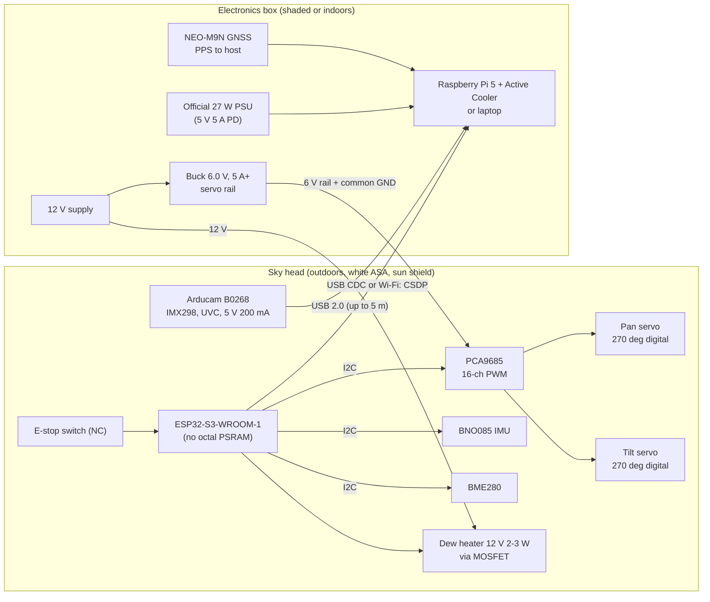
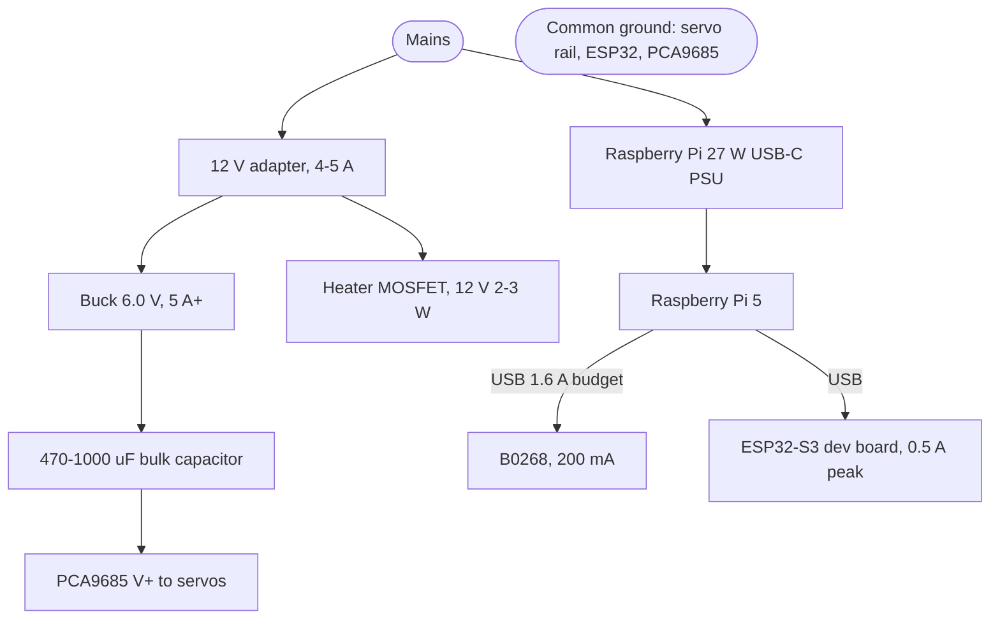

# CloudScope — Hardware Reference Designs

Version 1.0 · Phase P009 · 2026-10-04 · Evidence: [`docs/research/P009_hardware_component_facts.md`](../research/P009_hardware_component_facts.md) (manufacturer datasheets; secondary and unverified items flagged there)

These designs turn the deployment configurations of `docs/requirements/use_cases.md` (D1–D4) into concrete parts, wiring, power and thermal layouts. Pin maps marked **provisional** are confirmed against the actual boards in the phase named.

---

## 1. Design principles (from the verified facts)

| # | Principle | Why (evidence, research §) |
|---|---|---|
| H1 | **Split the system into a sky head and an electronics box.** The head (outdoors, in the sun) holds only the camera, actuators, IMU, heater and a microcontroller. The host (laptop or Raspberry Pi 5), power supplies and any AI accelerator stay in a shaded or indoor box. | Pi 5 is rated 0–70 °C and the AI HAT+ 0–50 °C, while Bengaluru's April mean daily maximum is 34.1 °C (record 39.2 °C) before solar gain (§2.2, §2.4, §8.4) |
| H2 | **A separate servo/motor rail, never through the Pi or MCU 5 V pins**, with bulk capacitance and a common ground. | One MG996R stalls at 1.4 A, more than the Pi 5's whole 600 mA USB budget without a 5 A supply (§7.1, §2.1) |
| H3 | **Two pointing-accuracy tiers.** Servo tier ≈ 0.5–1° repeatability; stepper tier ≈ 0.1° with belt reduction, a home switch and sky-based calibration. | Servo deadband and PCA9685 quantisation (4.88 µs at 50 Hz) limit servos; StallGuard is too coarse for 0.1° homing (§4, §7) |
| H4 | **Full-sky coverage needs ≥180° pan plus tilt flip-over (or continuous pan).** | MG996R travel is 0–159° (manufacturer), which cannot cover the sky (§7.1) |
| H5 | **Do not trust magnetometer heading near motors.** Use the IMU for level/tilt (BNO08x Game Rotation Vector) and get azimuth from Sun/landmark calibration. | Motor magnets are hard-iron sources; BNO08x datasheet recommends Game Rotation Vector in unstable magnetic fields (§5) |
| H6 | **Prefer current, non-obsolete parts:** ESP32-S3 (or WROOM-32E), BNO085, NEO-M9N, Uno R4 Minima for the lite tier. | ESP32-WROOM-32 NRND; MPU-6050 reported obsolete, ICM-20948 EOL with 1.8 V I/O (§3, §5) |
| H7 | **Head materials:** printed parts in ASA, window in acrylic (PMMA) or glass, dew heater 2–3 W at 12 V under PWM, IP65-class sealing with IP68 glands. | PLA Tg 61 °C, PETG 81 °C, ASA 98 °C; polycarbonate yellows without UV protection (§8) |
| H8 | **Time:** host clock disciplined by NTP; GNSS PPS for sub-µs time on the Pi; DS3231 holdover for microcontrollers. | NEO-M9N PPS 30 ns RMS; DS3231 ±2 ppm at 0–40 °C (§6) |

## 2. Configurations at a glance

| Config | Host | Controller | Actuators | Accuracy | Status |
|---|---|---|---|---|---|
| **D1 Fixed camera** | Laptop (or Pi 5) | none | none | — | Works today (sky logger, P003) |
| **D2 Pan-tilt, laptop** | Laptop | ESP32-S3 over USB (or Wi-Fi) | 2 × 270° digital servos via PCA9685 | ≈ 0.5–1° | Reference design R1 |
| **D3 Field station** | Raspberry Pi 5 in shaded box | ESP32-S3 in head, or Pi GPIO directly | servos (R1) or steppers (R2) | 0.5–1° / ≈ 0.1° | Reference designs R1/R2 + Pi box |
| **D4 Lite** | Laptop or Pi 5 | Arduino Uno R4 Minima (preferred) or Uno R3 | 2 servos | ≈ 1° | Reference design R3 |

## 3. System block diagram (R1 on a field station)

## 4. Reference design R1 — servo pan-tilt (D2, D3)

### 4.1 Bill of materials

| Item | Part (recommended) | Notes |
|---|---|---|
| Camera | Arducam B0268 (IMX298, USB 2.0 UVC) | Full resolution is MJPG only; YUY2 up to 1024×768. Manual focus: lock the M12 thread at infinity. Cable unplugs at the board (ZHR-4), so it passes through a gland without the USB plug. |
| Controller | ESP32-S3-WROOM-1 dev board, **N8/N16 or N16R2 (not R8/R16V)** | Native USB CDC; R8/R16V octal-PSRAM variants are rated only to 65 °C. Alternative: ESP32-WROOM-32E (not the NRND WROOM-32). |
| PWM driver | PCA9685 breakout (e.g. Adafruit 815) | 12-bit, all channels share one frequency; calibrate the oscillator per board. Optional: ESP32 LEDC can drive servos directly with finer resolution. |
| Servos | 2 × 270° digital servos (DS3218-270 class) | 3 µs deadband ≈ 0.4°; pan 270° plus tilt flip-over covers the sky. **Do not use MG996R** for the head: 159° travel, 0–55 °C rating. DS3218 data is reseller-sourced (verify on arrival). |
| IMU | BNO085 breakout | I2C needs clock stretching (fine on ESP32); use Game Rotation Vector near motors. 6-axis fallbacks: BMI270, LSM6DSOX. |
| Environment | BME280 | Non-condensing rating: keep away from the window and the heater plume. |
| Time (optional) | DS3231 RTC on the ESP32; NEO-M9N GNSS + active antenna on the host | PPS 30 ns RMS for the Pi (see §6). |
| Servo rail | 12 V → 6.0 V buck, ≥ 5 A; 470–1000 µF at PCA9685 V+ | Both servos may stall together (2 × ~1.4–2 A). |
| Heater | 12 V, 2–3 W ring/resistor + logic-level MOSFET module | PWM from a dew-point margin (P053/P060). |
| E-stop | Normally-closed switch to GND on an input with pull-up | A broken wire reads as "stop" (fail-safe). |
| Enclosure | ASA printed parts, PMMA dome/window, PG7 IP68 glands, silica gel | Measure internal temperature in P094. |
| Supplies | 12 V ≥ 4–5 A adapter; official Raspberry Pi 27 W PSU for the Pi | The Pi needs the 5 V/5 A profile to give 1.6 A to USB (camera + disk). |

### 4.2 ESP32-S3 pin map (provisional — confirmed against the chosen dev board in P050)

| Function | GPIO | Notes |
|---|---|---|
| I2C SDA / SCL (PCA9685 0x40, BNO085 0x4A, BME280 0x76, DS3231 0x68) | 8 / 9 | 400 kHz; addresses must not collide |
| Direct servo PWM (alternative to PCA9685) | 4 / 5 | LEDC |
| Heater MOSFET gate | 7 | LEDC low-frequency PWM |
| E-stop input | 6 | Internal pull-up, NC switch to GND |
| PCA9685 output-enable (OE) | 10 | High = all outputs off (hardware stop) |
| Status LED | board LED | — |
| Avoid | 0, 3, 45, 46 (strapping); 19/20 (native USB); 26–32 (flash); 33–37 on octal-PSRAM modules | Typical ESP32-S3 constraints; confirm in the module datasheet during P050 |

### 4.3 Power distribution

**Budget (Pi tier):** Pi 5 4–9 W; B0268 1 W; ESP32 ≤ 1.3 W (380 mA peaks at 3.3 V); sensors < 0.5 W; heater 2–3 W; servos a few watts on average and up to ≈ 17 W while both stall. A 12 V 4–5 A adapter plus the Pi's own 27 W supply gives margin. On a laptop host, the ESP32 and camera draw from the laptop's USB ports and the servo rail is still separate.

## 5. Reference design R2 — precision stepper pan-tilt (D3, ≈ 0.1°)

| Item | Part | Notes |
|---|---|---|
| Motors | 2 × NEMA 17 (or NEMA 14 for a lighter head), 1.8°/step | Standard steppers ±0.05° non-cumulative step accuracy (Oriental Motor figure) |
| Drivers | 2 × TMC2209 (UART configuration, StealthChop/SpreadCycle) | 2 A RMS; up to 4 drivers on one UART by address |
| Reduction | GT2 belt, 3:1–5:1 | ≈ 0.02–0.04° per 1/16 microstep after reduction |
| Homing | Hall-effect or micro-switch per axis | **StallGuard is not used for homing** (≥ 4 full steps, unreliable below ≈ 1 rev/s) |
| Pan cabling | Cable-wrap limit (e.g. ±270°) or slip ring | Prevents cable twist |
| Rail | 12–24 V to driver VM | Separate from logic |
| Calibration | Sun/landmark pointing model (P059) | Absolute accuracy comes from the sky, not the motors |

Controller: ESP32-S3 (STEP/DIR on four GPIOs + one UART for the drivers) or Pi 5 with the same signals. Stepper magnets sit close to the IMU, so the magnetometer is not used (H5).

## 6. Raspberry Pi 5 box and native GPIO tier (D3 without a microcontroller)

| Item | Part / setting | Notes |
|---|---|---|
| Host | Raspberry Pi 5 (8 GB), Active Cooler | Rated 0–70 °C; throttles from 80 °C SoC |
| Supply | Official 27 W PSU (5 V 5 A PD) | Otherwise USB is limited to 600 mA total; with a non-PD 5 A source set `PSU_MAX_CURRENT=5000` |
| Storage | USB SSD/HDD (needs the 5 A supply) or NVMe | Captures |
| OS | Raspberry Pi OS (Debian 13 "Trixie"), 64-bit | Qt 6.8 (ADR-001) |
| AI accelerator (optional) | **Raspberry Pi AI HAT+ (13 or 26 TOPS)** or AI HAT+ 2 | The AI Kit is discontinued. **0–50 °C ambient: box only, never in the head.** Models must be compiled to HEF on x86-64 Linux (Hailo DFC v3.x for Hailo-8/8L) with a calibration image set (P066). |
| RTC | On-board RTC with a rechargeable Li-Mn cell | Accuracy undocumented; GNSS/NTP discipline |

**Pi 5 GPIO pin map for the native tier (provisional — confirmed in P055):**

| Function | GPIO (header pin) | Notes |
|---|---|---|
| I2C1 SDA / SCL (PCA9685, BNO085, BME280) | 2 / 3 (pins 3 / 5) | BNO085 needs clock stretching: compatibility with the RP1 I2C controller is **unverified** — test in P055, else use SPI or UART-RVC |
| Pan / tilt hardware PWM | 12 / 13 (pins 32 / 33) | PWM0 channels 0/1 |
| GNSS UART (RX/TX) | 15 / 14 (pins 10 / 8) | UART0 |
| GNSS PPS | **17** (pin 11) | `dtoverlay=pps-gpio,gpiopin=17` — moved off the default GPIO18, which is a hardware PWM pin |
| E-stop input | 27 (pin 13) | NC switch to GND, pull-up |
| Heater MOSFET | 26 (pin 37) | Slow PWM |
| Spare hardware PWM | 18 / 19 | Free for a third axis or fan |

All Pi GPIO is 3.3 V: servo signals from the Pi are 3.3 V (accepted by most servos, verify per servo), and no 5 V output may be wired into a Pi input.

## 7. Reference design R3 — lite controller (D4)

| Board | What it supports | Notes |
|---|---|---|
| **Arduino Uno R4 Minima (preferred)** | CSDP-Lite: 2 servos, heartbeat, e-stop; IMU via BNO085 **UART-RVC** on the hardware `Serial1` (D0/D1) while USB stays free | 32 KB SRAM; 8 mA per pin: drive only signal inputs |
| Arduino Uno R3 | CSDP-Lite: 2 servos, heartbeat, e-stop; IMU only as a legacy MPU-6050 (raw over I2C A4/A5) if already owned | 2 KB SRAM cannot run the BNO08x library; its only UART is used by USB, so UART-RVC is not practical; MPU-6050 is reported obsolete |

Servo pins: D9 / D10 (the Servo library disables `analogWrite` on them, which is fine). The servo rail is the same separate 6 V supply as R1.

## 8. Thermal and enclosure plan (Bengaluru)

| Part | Rated ambient | Where it goes |
|---|---|---|
| AI HAT+ | 0–50 °C | Box only |
| MG996R servo | 0–55 °C | Not used in the head |
| ESP32-S3 R8/R16V | −40–65 °C | Not used; choose N8/N16/N16R2 (−40–85 °C) |
| Raspberry Pi 5 | 0–70 °C | Box (shaded/indoor) |
| DS3218 servo | −25–70 °C (reseller) | Head, with sun shield; verify |
| Arducam B0268 | −20–75 °C | Head |
| ESP32-S3 N8/N16, PCA9685, BNO085, BME280 | −40–85 °C | Head |

Climate facts used: April/May mean daily maxima 34.1/33.1 °C, record 39.2 °C; wettest month September (208 mm); annual rainfall 1,078 mm (IMD 1991–2020). Solar heat gain inside the head is **not known** and is measured in P094 (temperature logging with the BME280 and the ESP32's sensor) before the head is left outdoors unattended.

## 9. Decisions recorded by this phase

| # | Decision |
|---|---|
| HW-1 | Split head/box architecture (H1) for every outdoor deployment. |
| HW-2 | Servo tier uses 270° digital servos; MG996R is excluded from the head. |
| HW-3 | Precision tier uses NEMA steppers + TMC2209 + belt reduction + switch/Hall homing. |
| HW-4 | BNO085 is the reference IMU; magnetometer heading is not trusted near motors; azimuth comes from sky calibration. |
| HW-5 | ESP32-S3-WROOM-1 (non-octal-PSRAM) is the reference controller; Uno R4 Minima is the reference lite controller; Uno R3 is supported without a modern IMU. |
| HW-6 | The Raspberry Pi AI HAT+ replaces the discontinued AI Kit as the optional accelerator, box-mounted only, with an x86-64 HEF compile step. |
| HW-7 | Pi 5 GNSS PPS moves to GPIO17. |
| HW-8 | All safety-relevant inputs (e-stop) are normally-closed and fail-safe; PCA9685 OE gives a hardware "all outputs off". |

## 10. Open items (verified on hardware in later phases)

| Item | Phase |
|---|---|
| B0268 mode list, UVC control ranges, vertical/diagonal FOV, lens distortion | P020, P021, P031 |
| DS3218 stall current, deadband and travel on the delivered units | P051 |
| PCA9685 oscillator trim per board | P051 |
| BNO085 on the RP1 I2C controller (clock stretching) | P055 |
| Internal head temperature under Bengaluru sun | P094 |
