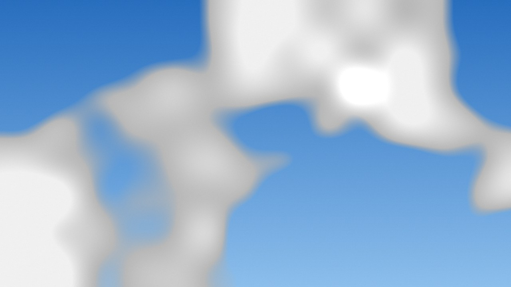

# P018 — Simulators

Status: DONE     Date: 2026-10-06     Commit: (this commit)

## Objective
Simulated devices behind the hardware interfaces of P017, so that CloudScope can be developed, tested and tried without hardware: a camera (synthetic sky and replay of recorded pictures), a pan-tilt mount with kinematics, latency, noise and limits, an IMU and a GPS receiver.

## Requirements covered
FR-CTL-02 (simulated camera, mount, IMU and GPS usable wherever real ones are), NFR-DATA-03 (simulated data is labelled: device information and every frame; files, UI and API follow in their phases), constraint C1 and risk K2 of Gate R (no hardware at hand: simulator first). Groundwork for testing FR-CAM-04/05 (read-back, automatic controls), FR-CAM-08 and FR-SEQ-05 (drops, camera loss and recovery), FR-SAF-05/06/07 (emergency stop, stalled axis, rain and temperature), FR-MIS-02 (dry runs).

## Design notes
New in `core/include/cloudscope/` (2,843 lines with their sources):

| Header | Content |
|---|---|
| `sim/sim_rig.hpp` | `SimulationConfig` and `SimRig`: the simulated world shared by all devices; mount mechanics; the hooks with which a test makes things happen |
| `sim/motion_profile.hpp` | `AxisProfile`: speed-up, cruise, slow-down motion of one axis from any position and velocity, as a function of time |
| `sim/sim_devices.hpp` | `SimMount`, `SimImu`, `SimGps`, `SimEnvironment` |
| `sim/sim_camera.hpp` | `SimCamera`, the picture sources (`IFrameSource`): synthetic sky and replay |
| `sim/sim_driver.hpp` | `SimDriver` (driver "sim" for the registry) and the `[simulation]` configuration section |
| `geometry/rotation.hpp` | Quaternion operations, camera orientation from azimuth and elevation and back |
| `app/devices.hpp` | `add_configured_drivers()`: the one place where the application's drivers are named |

`cloudscope-info --devices` lists the devices usable with the present configuration. Guides: [`docs/dev/simulators.md`](../dev/simulators.md), user manual section *Simulated devices*.

Decisions:
- **One rig behind all devices.** The IMU measures the orientation the mount really has, so a fault in one device is visible through another (a stalled axis that a servo mount cannot report shows in the IMU). Faults are set in one place, `SimRig`.
- **State is a function of time, not of steps.** Mount, IMU, GPS and environment sensors have no thread: they compute their state from the clock they are given when asked. On a `ManualClock` a scenario of minutes runs in microseconds and is exactly repeatable; on the system clock the same code runs in real time. Commands are stored as a timeline of motion profiles, which makes latency exact: a command acts one latency later in the state the mechanism has *then*, and a status describes the state one latency *ago*.
- **The camera behaves like a camera in time.** Frames become available at the mode's rate (lowered by a long exposure); a late reader finds three frames buffered and has lost the rest, visible as a gap in the sequence numbers; a read with nothing due waits for its timeout. For tests on a manual clock this pacing can be switched off.
- **An exposure model instead of a fixed picture.** Light scales with exposure and gain and clips; the Sun's disc stays saturated; noise grows with gain; the camera has its own automatic exposure. Automatic-exposure and HDR work (P025) and the control read-back (P021) can therefore be developed against it.
- **Replay passes JPEG files through untouched** in MJPEG mode: the decoder path (P023) sees exactly the bytes a camera recorded.
- **One user per device**, as with hardware: a second `open()` of the same simulated device fails.
- **Simulated devices are listed by default** (`[simulation] enabled = true`), as test cameras are in comparable programs, and always marked `[simulated]`.
- **Noise is tied to the sample, not to the read:** the same sample read twice is identical, and a run with the same seed repeats exactly.

## Work log
1. Motion profile and rotation mathematics with their tests.
2. `SimRig` with the mount model (timeline of profiles, latency, feedback noise, stall, unreachable controller), then mount, IMU, GPS and environment devices.
3. `SimCamera` with timing, frame buffering and faults; the synthetic sky source with exposure model and six pixel formats; the replay source.
4. `SimDriver`, the `[simulation]` section of the configuration (schema and defaults), `add_configured_drivers()`, `cloudscope-info --devices`.
5. Ran every simulated device through the contract tests of P017; wrote 67 tests in all.
6. Wrote the simulator guide and the manual section; raised the time limit of the static-analysis CI job.

## Verification
| Check | Result |
|---|---|
| Windows, MSVC 19.44, warnings as errors | 232/232 Debug · 233/233 Release |
| Debian 13, GCC 14.2, warnings as errors | 231/231 Debug · 232/232 Release |
| Ubuntu 26.04, GCC 15.2, warnings as errors | 231/231 Debug · 232/232 Release |
| AddressSanitizer + UndefinedBehaviorSanitizer, all tests | 231/231, no reports |
| ThreadSanitizer, all tests | 231/231, no reports |
| clang-format (86 files), clang-tidy on the new and changed files | clean (first run: 7 findings, all fixed in code) |

67 new tests: motion profile 9, rotations 6, rig and mount 13, IMU, GPS and environment 11, camera 17, driver, configuration and the whole rig 9, command line 2.

What the tests establish:
- **Contracts.** The simulated camera (synthetic and replay), the mount (with and without feedback), the IMU, the GPS receiver and the environment sensors pass the same contract tests as the mocks: any of them can stand in for a real device behind its interface.
- **Motion.** Hand-calculated cases (short move, long move, reversal, overshoot, speed above the limit, braking) and 144 combinations of start velocity, distance and limits: every move ends exactly at its target, without jumps, within speed and acceleration limits. From rest, both axes follow a straight line and arrive in the same instant (2.125 s for the tested move, as calculated).
- **Mount.** A command does nothing for the command latency; a status shows the state one telemetry latency ago with that time stamp. `stop` brakes over 0.25 s and 7.5° from 60°/s; an emergency stop has no braking distance. A new target mid-move blends in without a jump. A stalled axis stays put while a mount without feedback reports the commanded position; with feedback the mount reports the fault and refuses moves; the released axis catches up at maximum speed. With the controller unreachable, calls fail with `Io` and the mechanism finishes its move. Feedback noise has the configured standard deviation (0.2° ± 0.02° over 4,000 samples).
- **IMU.** Without noise it reports the true orientation (also straight up) to 10⁻⁶ degrees; with noise within its bounds; samples change at the sensor's rate and a repeated read returns the identical sample; the heading drifts by the configured 0.5°/min and not at all with a north reference.
- **GPS and environment.** No position before the first fix, when the fix is taken away, or after re-opening; positions scatter around the site with the configured 2.5 m (height 3.75 m) over 2,000 solutions; one solution per second. Environment values follow what is set, rain included.
- **Camera picture.** Twice the exposure gives twice the level (ratio 2.0 ± 0.1); 6 dB of gain doubles it; at 100 ms nearly everything clips; at 0.05 ms the sky is black and the Sun's disc is still saturated (452 ± 30 pixels, a disc of radius 12). White balance shifts red against blue; brightness adds 30 levels for a setting of 30; noise between two frames is of the expected size (between 1.2 and 3.5 levels for 1.5 per frame) and rises more than fourfold with 18 dB of gain. Automatic exposure brings the mean level to 110 ± 12 from far too dark and far too bright, and reports the exposure it chose. Clouds drift with time; the same seed gives the same sky. All six pixel formats carry the same picture (means agree within one level; the MJPEG frame decodes to it).
- **Camera timing and faults.** In real time no frame arrives before the sensor could have made it; a 250 ms exposure lowers the rate accordingly; a reader that was busy for 0.6 s finds a frame waiting and has lost at least ten; a read with nothing due returns `Timeout` after its timeout. Lost frames leave a gap in the sequence; a stalled camera times out but stays streaming; a pulled cable ends the stream with `Io`, the camera can then not be opened and disappears from the device list until it is back.
- **Replay.** Pictures come in name order and round again, exactly as decoded from the files; JPEG files are passed through byte for byte in MJPEG mode; a picture of another size or type is brought to the size of the first; an empty or missing folder, an undecodable file and a file that vanishes mid-replay are errors that say what is wrong.
- **Whole rig** (real time, three threads): the camera streams through the frame hub to a queue consumer and a latest-frame consumer while the mount moves to a new position; every frame read is accounted for, the frames arrive in order, the mount arrives, the IMU agrees with the pointing within 1.5°, GPS and environment deliver.
- **Configuration and command line.** The `[simulation]` section is validated like every other (unknown keys and out-of-range values are named); `cloudscope-info --devices` lists five simulated devices by default, six with a replay folder, none when simulation is off.

Speed of the simulated camera (Release build, laptop with i7-14650HX, one thread, frames made as fast as possible):

| Mode | Nominal | Windows 11 | Debian 13 in Docker |
|---|---|---|---|
| 640 × 480 BGR8 | 30 fps | 570 fps | 448 fps |
| 640 × 480 MJPEG | 30 fps | 377 fps | 370 fps |
| 1280 × 720 BGR8 | 30 fps | 224 fps | 264 fps |
| 1920 × 1080 BGR8 | 30 fps | 64 fps | 109 fps |
| 1920 × 1080 MJPEG | 30 fps | 54 fps | 78 fps |
| 3840 × 2160 BGR8 | 15 fps | 16 fps | 29 fps |

A frame of the simulated sky camera (1280 × 720, default settings; written by the test *a picture of the simulated sky can be written for people to look at*):

## Exit criteria
- [x] All later phases testable without hardware: every device kind the plan names is simulated behind the HAL, passes the contract tests, and a whole rig runs end to end without hardware. Read literally the criterion goes further than what exists; the phases that need more are listed under Deviations with the phase that supplies it. CI result for this commit checked after the push.

## Safety & failure-mode notes
- **A simulator shows that code agrees with our model of a device, not with the device.** The mount model has no backlash, overshoot or load; the camera has no lens, rolling shutter or defects. Every hardware phase is still verified on hardware, and "passes on the simulator" must never be reported as "works".
- **The contract tests again found a real fault on their first run**, this time in the simulator: a mount asked for its status right after start-up reported "moving", because the status looks one telemetry latency into the past, before the rig existed. Fixed; the case is now covered by every contract run.
- **Emergency stop is modelled as an instant halt.** That is an assumption about a small servo head (NFR-SAFE-01 asks for 100 ms). It must be measured on the real mount in P060; the simulator must not be the evidence for that requirement.
- **A servo mount cannot see a stalled axis**, and the simulator reproduces that honestly: the status says "idle at target" with `position_measured == false`. Stall detection needs the IMU cross-check (FR-SAF-06, P057/P060), which the shared rig makes testable.
- **With the controller unreachable, the simulated mechanism finishes its move.** Real firmware must stop on heartbeat loss (FR-SAF-04); that behaviour does not exist in the simulator yet and arrives with the controller protocol (P047, P060).
- **Replayed pictures are stamped with the current time and labelled simulated.** They are recordings shown now, not observations of now; anything saved from them carries the simulated flag.
- **Privacy.** The default simulated GPS site is the centre of Bengaluru rounded to 0.01°, not a real installation.
- **Timing tests** assert only what cannot fail on a slow machine (a frame is never early; a busy reader has lost frames), because CI machines and sanitizer builds are several times slower than the laptop.
- **Margins.** On Windows the 4K mode is made at 16 fps against a nominal 15 (29 fps on Linux on the same laptop); on a slower machine it will lose frames, which the sequence numbers show. The static-analysis CI job took 35 minutes for P017 and grows with every file; its limit was raised from 45 to 120 minutes. Shortening it (analysing test code with fewer checks) is worth a look in a later phase.
- **Compilers.** GCC 14 in Release reported a buffer overflow inside the standard library for a vector filled by repeated `push_back` (a known false positive); the list is now written as one initialiser. GCC 15 did not report it, GCC 14 did not report the P017 one: both containers stay in the local check.

## Deviations & next phase
- **Not simulated yet**, each needed by specific later phases and supplied there (full table in `docs/dev/simulators.md`):
  - The picture does not depend on where the mount points, and the Sun does not follow date, time and site. Needed to test overlays against the Sun (P037), camera-to-IMU alignment (P058), the pointing model (P059), keep-out on images (P060), sky surveys (P077) and cloud tracking (P079) on the simulator. Supplied with the camera models (P031) and mount kinematics (P056); the picture source of the simulated camera is an interface (`IFrameSource`) so that a pose-aware source can be added without changing the camera.
  - Sensor defects and a calibration target (dark current, vignetting, a checkerboard): needed for P026 and P031 on the simulator.
  - Recorded time and sidecars of replayed pictures (P072), heartbeat loss and keep-out in the controller (P047, P060), accelerated time for long runs (P029, P075).
- The plan names Eye2Sky and B0268 sessions as replay material. The replay camera plays any folder of JPEG or PNG pictures, which covers both, with one limit: sub-folders are not searched, so an archive sorted into folders per hour is replayed one hour at a time. CI tests use the three CC0 pictures in `tests/data`, since recordings are not committed.
- The configuration gained a `[simulation]` section without a format-version change: files written for format 1 stay valid.
- Speeds were measured on the laptop only; a Raspberry Pi 5 has not been measured.
- **Stage B (engineering foundation, P011–P018) is complete.** Tag: `stage-B-complete`.
- Next: **P019 — Device enumeration** (Stage C, camera subsystem). It is a hardware phase: it needs the Arducam B0268 connected. By the plan, Stage C starts after 16 November 2026.
